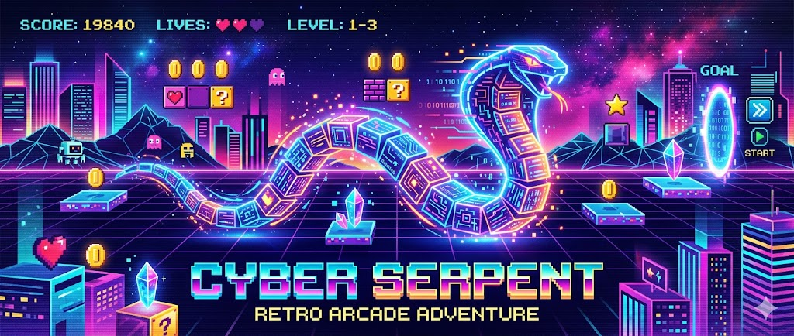

# 🐍 Cyber Serpent - Snake Game Landing Page



## 📖 Sobre o Projeto

Cyber Serpent é uma Landing Page moderna e responsiva desenvolvida para apresentar uma versão futurista do clássico Snake Game (Jogo da Cobrinha).

O projeto combina elementos retrô dos arcades dos anos 80 e 90 com uma estética cyberpunk neon, proporcionando uma experiência visual imersiva e interativa.

Além da Landing Page, o projeto possui uma versão jogável do Snake Game integrada através de uma página dedicada.

---

# 🎯 Objetivos do Projeto

- Criar uma Landing Page moderna para divulgação do jogo.
- Utilizar HTML, CSS e JavaScript.
- Aplicar conceitos de responsividade.
- Implementar recursos de interatividade.
- Desenvolver uma versão funcional do Snake Game.
- Aplicar boas práticas de organização de código.

---

# 🚀 Tecnologias Utilizadas

- HTML5
- CSS3
- JavaScript ES6
- Google Fonts (Orbitron)

---

# 🎮 Funcionalidades da Landing Page

## Header

- Logo personalizada Cyber Serpent
- Menu de navegação
- Menu responsivo para dispositivos móveis

---

## Hero Section

- Título principal
- Subtítulo explicativo
- Botão CTA (Jogar Agora)
- Imagem principal do jogo

---

## Sobre o Jogo

Apresenta informações sobre:

- História do Snake Game
- Popularização nos celulares Nokia
- Mecânicas básicas do jogo

---

## Recursos

### 🎮 Controle Simples

Movimentação intuitiva utilizando as setas do teclado.

### 🏆 Sistema de Pontuação

Pontuação baseada na quantidade de itens coletados.

### ⚡ Dificuldade Progressiva

O desafio aumenta conforme a cobra cresce.

### 🕹 Visual Retrô Cyberpunk

Estilo inspirado em arcades clássicos com iluminação neon.

---

## Galeria

Galeria com imagens do jogo contendo:

- Modal de ampliação
- Efeito hover
- Layout responsivo

---

## Chamada Final (CTA)

Convite para o usuário experimentar o jogo através de um botão de destaque.

---

## Footer

Contém:

- Nome do desenvolvedor
- GitHub
- Ano de desenvolvimento

---

# 🕹 Funcionalidades do Snake Game

O botão "Jogar Agora" leva para uma página exclusiva contendo o jogo.

## Recursos Implementados

### ✅ Movimentação da Cobra

Controle através das teclas:

- ↑ Cima
- ↓ Baixo
- ← Esquerda
- → Direita

---

### ✅ Sistema de Pontuação

A cada item coletado:

- A cobra cresce
- A pontuação aumenta

---

### ✅ Colisão com Paredes

Ao tocar qualquer borda do mapa:

- Game Over

---

### ✅ Colisão com o Próprio Corpo

Ao colidir com qualquer parte da própria cobra:

- Game Over

---

### ✅ Grade de Navegação

O tabuleiro possui linhas quadriculadas para facilitar:

- Visualização
- Planejamento de movimentos
- Precisão do jogador

---

### ✅ Interface Neon

Elementos com efeito glow:

- Cobra
- Comida
- Borda do tabuleiro

---

### ✅ Tela de Game Over

Exibe:

- Pontuação final
- Opção de jogar novamente

---

# ✨ Efeitos Visuais

## Landing Page

- Animação Glow
- Hover Effects
- Scroll Suave
- Cards Animados

## Jogo

- Efeito Neon
- Sombras Dinâmicas
- Grade Visual
- Interface Futurista

---

# 📱 Responsividade

O projeto foi desenvolvido para funcionar em:

| Dispositivo | Suporte |
|------------|----------|
| Desktop | ✅ |
| Notebook | ✅ |
| Tablet | ✅ |
| Smartphone | ✅ |

---

# 📂 Estrutura de Pastas

```text
Cyber-Serpent/
│
├── index.html
├── game.html
│
├── style.css
├── script.js
├── game.js
│
├── README.md
│
└── img/
    ├── hero.jpg
    ├── gameplay.jpg
    └── arcade.jpg
```

---

# 🎨 Paleta de Cores

| Cor | Hex |
|------|------|
| Azul Neon | #00FFFF |
| Rosa Neon | #FF00FF |
| Roxo Escuro | #14052D |
| Fundo Principal | #090018 |
| Branco | #FFFFFF |

---

# 🔧 Melhorias Futuras

- Sistema de ranking
- Salvamento de recordes
- Música de fundo
- Efeitos sonoros
- Modo difícil
- Power-ups especiais
- Versão mobile com controles touch
- Sistema de fases

---

# 📸 Capturas de Tela

### Landing Page

- Hero Section
- Recursos
- Galeria

### Snake Game

- Interface Cyberpunk
- Sistema de Pontuação
- Tabuleiro Neon

---

# 👨‍💻 Desenvolvedor

**Nome:** Seu Nome

**Curso:** Desenvolvimento de Sistemas - SENAI

**GitHub:**

https://github.com/seuusuario

---

# 📅 Data

Junho de 2026

---

# 📄 Licença

Projeto desenvolvido para fins educacionais e acadêmicos.

Todos os direitos reservados ao autor.
